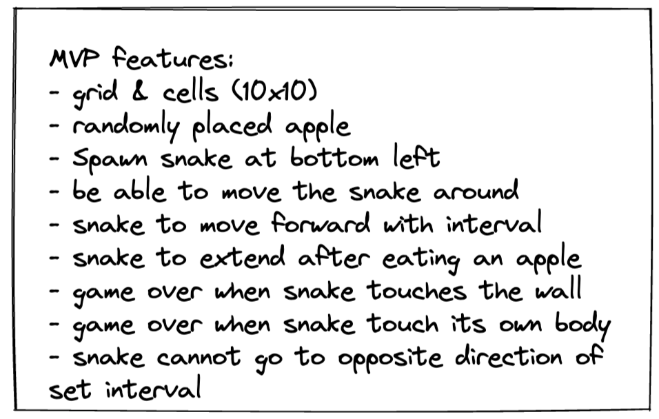
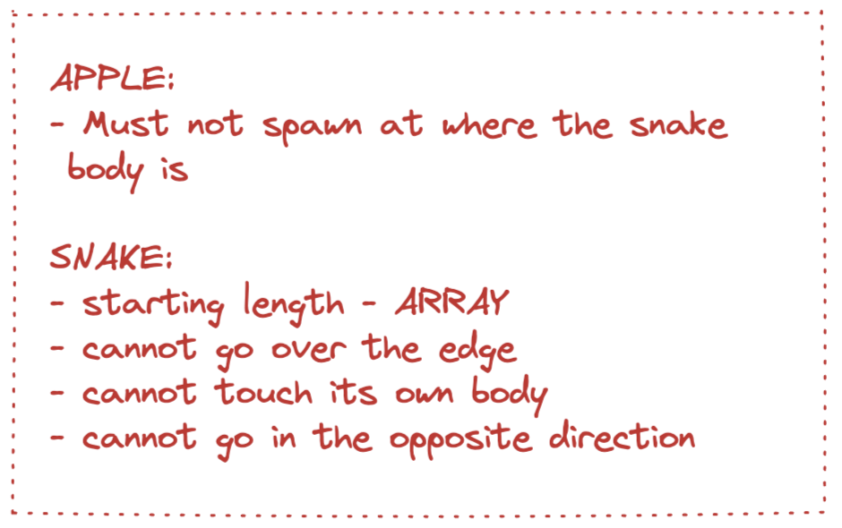
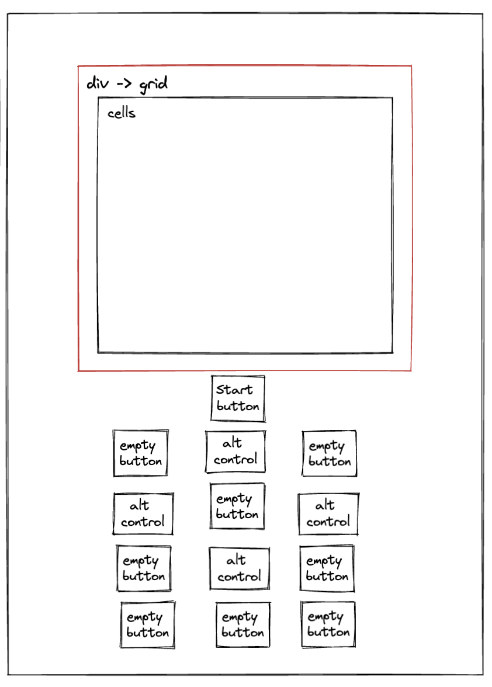
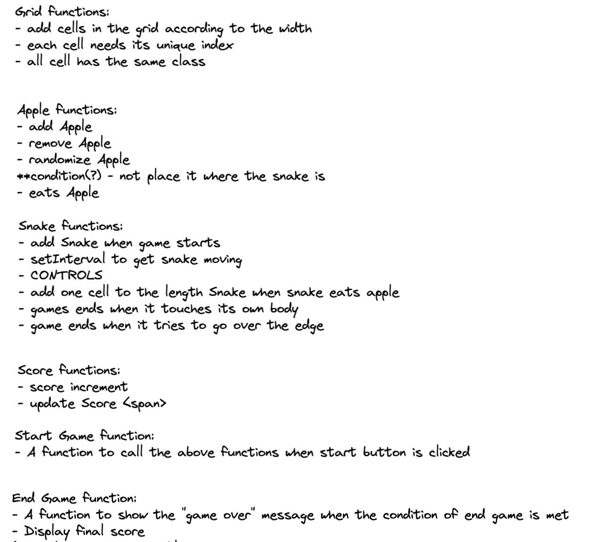
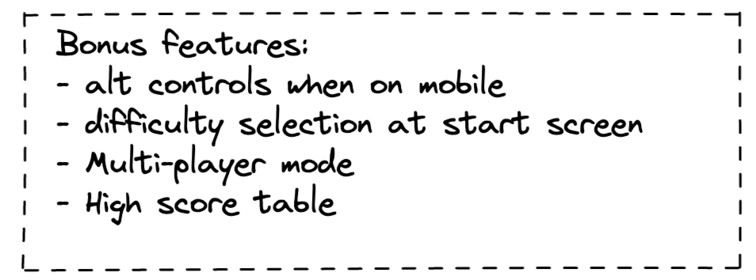
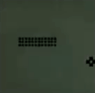
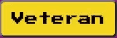
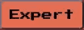

# GA PROJECT 01 - ALICE LO

## Project description

As the first project in the SEI course, we were tasked to build a web game using JavaScript. I chose Snake Game as it was one of my favorite games when I was a kid, and I remember vividly playing this game on my mom's Nokia 8210. This has been a fun project to work on, and to polish and challenge my JavScript skills.

I dedicate this project to my mom and her white Nokia 8210 from 1999. :)

## Deploment link

https://siuusunn.github.io/ga-project-01/

## Getting Started/ Code Installation

<!-- NEED MORE INFO ON WHAT TO WRITE HERE -->

Instructions

Explain how the reader accesses your code. Include a step by step approach.

Insert your Getting Started/Code Installation here:

## Working Team & Timeframe

A solo project by Alice Lo (https://github.com/siuusunn).

Project brief was received on 9th Nov 2022 and I started working on the project on 10th Nov 2022. MVP was finished on 13th Nov 2022.

## Technologies Used

Front End:

- HTML
- CSS
- JavaScript

Development Tools:

- Visual Code Studio

Other Tools:

- Adobe Photoshop
- Sketch.io
- Excalidraw

## Brief

Build a snake game with the three key requirements below:

- The snake should be able to eat the apple and grow longer
- The snake speeds up as it eats more apples
- The game should end when the snake hits the wall or itself

## Planning

All my planning for this project were either drawn or written out on Excalidraw.

My first step of planning was to list out all the features that the MVP should have:



And then I listed out the important mechanics of the moving elements in the game. If these boxes are not ticked, the game will break:



I also drew a very simple wireframe to represent the layout I had in mind (mimicking a phone) which helped me think of what elements to use in the HTML:



And listed all the functions that I would need for the MVP:



Lastly, some bonus features!



## Code Process

I broke down the development into five main pieces and work on them one at a time:

1. The grid where the game operates on
2. The apple
3. The snake
4. Eating the apple
5. Game over conditions

### The Grid

The is the easiest piece in code process. I first created a `div` called `grid` to contain the cells in the HTML. As I wanted to create a 10x10 game board, in JavaScript, I declared a `width` variable with the value of 10, a `gridCellCount` variable with the value of width \* width, and an empty array called `cells`.

Then in the `createGrid()` function, a `for` loop creates 100 `div` each with its own unique `data id`. These are then pushed in the `cells` array and placed inside the `grid`.

### The Apple

The apple functions can be broken down into three parts:

1. Randomizing the apple position
2. Adding the apple
3. Removing the apple

First thing was to declare an `applePosition` variable and set it to `0`. And in the CSS, I set the `background-color` of class `apple` to red.

Then I wrote a `getRandomPosition()` function to generate a random number within `gridCellCount` which is 100.

And then two similar functions to add and remove the apple. Using the number generated from `getRandomPosition()`, these two functions will add and remove `apple` from the class list.

To wrap everything up, a final function for the apple is created called `spawnApple()` which first remove the apple from its current position, get a random position, and then add the apple in the new position. I included a `while` loop here so to prevent the function from generating a cell number where the snake body is.

```js
function getRandomPosition() {
  let randomPosition = Math.floor(Math.random() * gridCellCount);
  while (snake.includes(randomPosition)) {
    randomPosition = Math.floor(Math.random() * gridCellCount);
  }
  return randomPosition;
}
```

### The Snake

The snake is the most complicated piece in the development. I broke it down into several parts:

1. Rendering and removing the snake
2. Moving the snake
3. Controlling the snake

First step is to declare `snake` as an array so that it can be extended when it eats an apple (For testing purposes, I put `[42, 41, 40]` in the array). And in the CSS, `background-color` of the class `snake` is set to black.

#### Rendering and Removing the Snake

To create the snake (and remove) on the game board, two simple functions using `forEach` method are used. A class of `snake` will be added to the corresponding cell, and vice versa.

```js
function renderSnake() {
  snake.forEach((snakeBody) => cells[snakeBody].classList.add("snake"));
}
```

#### Moving the Snake

A `directionOfTravel` variable is created and the default value is `"right"`.

`getDirectionOfTravel()` function is created to capture the `keyCode` when the user press an arrow key. If the user presses "down" arrow key, the function will change the `directionOfTravel` variable to `"down"`, so on so forth.

```js
if (event.keyCode === 40) {
  directionOfTravel = "down";
}
```

To prevent the snake from going in reverse, I wrote another condition so the user cannot make the snake go to the opposite direction.

```js
if (event.keyCode === 40 && directionOfTravel !== "up") {
  directionOfTravel = "down";
}
```

Time to make the snake move for real! I first wrote four movement functions to make the snake move. Take `moveUp()` function for an example, it first remove the snake from its current position, then it `.pop` the last array element (i.e. the "tail"). Then it `.unshift` an element at the beginning of the array (i.e. the "head") with an value of `(snake[0] - 10)`.

```js
function moveUp() {
  removeSnake();
  snake.pop();
  snake.unshift(snake[0] - 10);
  renderSnake();
}
```

(Since the board is 10x10, +1 = move right, -1 = move left, +10 = move down, -10 = move up).

In the `moveSnake()` function, two variables are decalared:

```js
const x = snake[0] % width;
const y = Math.floor(snake[0] / width);
```

Four `if` statements are in the functions to cover all four directions. The `x` and `y` declared earlier allow me to prevent the snake from going beyond the wall.

```js
if (directionOfTravel === "right" && x < width - 1) {
  moveRight();
  return directionOfTravel;
}
```

The last step here is to `setInterval` in the `moveSnake()` function to make the snake move automatically in the default speed stored in the `snakeSpeed` variable.

#### Controlling the Snake

The `getDirectionOfTravel()` function earlier then ties in with the `moveSnake()` function and now the snake is controllable!

### Eating the Apple

The `eatsApple()` function is created to check if the snake has eaten the apple. It has a very simple condition to check if the snake head is in the same cell as the apple (thus eating the apple):

```js
    if (cells[snake[0]].classList.contains("apple"))
```

And then it will excute `spawnApple()` again, make the current score go up, grow the snake with `snake.push()`, clear the interval, render the snake according to the new array, update the `snakeSpeed` and run `moveSnake()` again (so that the snake moves faster everytime it eats an apple!).

### Game Over Conditions

There are only two conditions that will make the game end:

1. Snake hitting the wall
2. Snake hitting its own body

I first created a `gameOver()` function which will clear interval when executed. Then I created a `checkForCollision()` function with `if` statements to check if the above conditions are true.

First is to check if the snake is hitting the wall:

```js
if ((snake[0] + width >= width * width && directionOfTravel === "down") ||
(snake[0] % width === width - 1 && directionOfTravel === "right") ||
(snake[0] % width === 0 && directionOfTravel === "left") ||
(snake[0] - width <= 0 && directionOfTravel === "up"))
```

The latter part of each condition above is to allow user to maneuver when the snake is AT the wall.

Second step is to check if the snake is hitting its own body:

```js
if ((directionOfTravel === "right" && cells[snake[0] + 1].classList.contains("snake")) ||
(directionOfTravel === "down" && cells[snake[0] + 10].classList.contains("snake")) ||
(directionOfTravel === "left" && cells[snake[0] - 1].classList.contains("snake")) ||
(directionOfTravel === "up" && cells[snake[0] - 10].classList.contains("snake")))
```

If any of these conditions return `true`, the function `gameOver()` will run, which will clear the interval and display "GAME OVER" text on the webpage.

All the features that the MVP needs are done at this point, so I moved on to enhacing the game.

### Enhancements

#### Start button

I added a `playButton` to start the game. When it's click, it will execute the `startGame()` function:

```js
function startGame() {
  removeGameOverText();
  removeSnake();
  snake = [43, 42, 41, 40];
  clearInterval(timer);
  directionOfTravel = "right";
  currentScore = 0;
  score.innerHTML = currentScore;
  renderSnake();
  playButton.disabled = true;
  spawnApple();
  checkGameSpeed();
  moveSnake();
}
```

It will remove the "GAME OVER" text, reset the snake to its default position and direction, clear the interval, reset the score and user is able to start the game all over again.

#### Choose Difficulty

Three buttons are created in the HTML to allow user to pick a difficulty level: Noob (easy), Veteran (medium), and Expert (hard). Each has a default speed, Noob being the slowest and Expert the fastes.

When the button is clicked, the variable `snakeSpeed` will be updated according to the difficulty level. The `<span class="difficulty-text">` will also be updated accordingly to let user know what the current difficulty level is.


#### High Score Table

A `<ol>` titled "HIGH SCORES" with three `<li>` to display the top three high scores. The `checkHighScore()` function is called `gameOver()` function is executed to check if the current score is high enough to be on the high score table.

The high scores are stored in an array (default `[0, 0, 0]`). The `checkHighScore()` function checks the `currentScore` against each array item.

### Styling

#### Game Board

The original idea was to use simple shapes to recreate a phone, but I decided to use an actual image of an old Nokia 8210 as it was my inspiration. The game board `grid` is positioned on the phone screen with transparent border to mimick the original snake game.

#### Snake and Apple

Using sketch.io, I drew the images for the snake and the apple and exported them in `png` format, to mimick the pixelated elements in the original game.

 

What these look like on game board:



#### 8-bit Styling

To further tie in with the 8-bit/ pixelated theme of the original game, I used `Press-Start-2P` font family from Google for all the texts.

And styled the buttons in a similar aesthetic:

```css
button {
  font-family: "Press Start 2P", sans-serif;
  border-radius: 5px;
  cursor: pointer;
}

#easy-button {
  background-color: #92cd41;
}

#easy-button:hover {
  background-color: #76c442;
  box-shadow: inset -4px -4px 0px 0px #4aa52e;
}

#easy-button:active {
  background-color: #76c442;
  box-shadow: inset 4px 4px 0px 0px #4aa52e;
}
```

Results:

  

#### Responsive Design

One idea I had from the start was that when the webpage is opened on a mobile device, it should only display the phone and user can control the snake using the number pad on the phone image, like an actual Nokia 8210! So I added four transparent buttons and positioned them on 2, 4, 6, 8 buttons on the phone image. Set everything else's `display` to `none`. Added another button on the phone image to allow user to start & restart the game.


Each button will call their respective function on click, and update the `directionOfTravel`, working exactly like the arrow keys.

```js
function numPadControlUp() {
  if (directionOfTravel !== "down") {
    return (directionOfTravel = "up");
  }
}
```

## Challenges

### Spawning the Apple

To get the apple generated in a random position that is not the snake body is a tricky one for me. I used `if` statements but didn't work. Also I have to taken into consideration that the snake is constantly moving, and it is an array.

So I experimented with `loops`. As I do not know how many times the loop will run until it gets the desired result, I went with a `while` loop and it tackled the problem perfectly.

```js
while (snake.includes(randomPosition)) {
  randomPosition = Math.floor(Math.random() * gridCellCount);
}
```

### Rendering Snake

I was stuck in this part for a long time as I was trying to manipulate the entire `snake` array when the snake moves. After discussion with the instructor, I found a great way to handle this which is only to change the first and the last items in the array according to the `directionOfTravel`.

### Check For Collision

By far the most difficult part in the development for me, hard stuck here for HOURS! As I am really really bad at math, I had to draw the game board on a piece of paper and manually count them so that I can make sure the conditions I wrote are correct.

To check if the snake is hitting its own body, I wrote these conditions:

```js
if (cells[snake[0] + 1].classList.contains("snake") ||
cells[snake[0] + 10].classList.contains("snake") ||
cells[snake[0] - 1].classList.contains("snake") ||
cells[snake[0] - 10].classList.contains("snake"))
```

The logic seemed right but it didn't work. So I experimented and tested around, and finally got it working by adding a condition to check the `directionOfTeavel` to each of the conditions above.

### Moving the Snake

At the early development stage, I created the `moveSnake()` function to move the snake with `setinterval` and another function to manually control the snake. Doing so caused a major bug where the user is able to move the snake around after `gameOver()` is executed.

After reading the code carefully, I realized the codes in these two functions are 99% same. So I refactored the `moveSnake()` function, deleted the manual movement function, and fiex this issue.

### Set Interval

When I was testing the game, I found out that when I clicked the `playButton` to restart the game, the snake moved at the speed of when last game ended. After retracing the steps I realized that it was because the `snakeSpeed` had not been reset to default after the game ends.

This problem was solved by first declaring a `currentDifficulty` variable. When the different difficulty buttons are clicked, the variable will be updated to either `"easy"`, `"medium"` or `"hard"`. Then I created a `checkGameSpeed()` function to check the difficult level and update `snakeSpeed` accordingly, and called it whenever `startGame()` is executed.

```js
function checkGameSpeed() {
  if (currentDifficulty === "easy") {
    snakeSpeed = 500;
  } else if (currentDifficulty === "medium") {
    snakeSpeed = 300;
  } else if (currentDifficulty === "hard") {
    snakeSpeed = 100;
  }
}
```

### Arrow Keys Scrolling Page

The game is controlled by arrow keys but when the keys are pressed, they will also scroll the page, causing an unpleasant experience when the game is running. After some research I found out that I can prevent this with `.preventDefault()`. So I added a new `preventScrolling()`function to excute this and tie it in with `window.addEventListener("keydown")`

## Wins

### Breaking Down Codes in Small Functions

I wrote a function for each action and it really helped with the readability (at least for myself!), and made it easier to debug when something went wrong. Also makes my life easier when I wanted to add extra functionalities to the game!

### While loops

I am not very confident with `while` loops, I have written many that just would not stop running. But I managed to identify that it needed to be used when spawning a random apple, and wrote one that functions perfectly, and now I understand fully how to work with them.

### The `checkForCollision()` Code Block

After some HARD calculations, HARD googling, HARD scratching my head off and HARD experimenting, I got this to work without causing bugs (It was a glorious moment). Now I know that which condition comes first matters **_A LOT_**, and if there are a mountain of conditions, use `if` statements instead of `switch`.

### The Design

I am very happy with how the design turned out: an old-school, 8-bit vibe (and ironically ugly) webpage and the game's functions and aesthetic are exactly like the original Snake Game on the Nokia 8210.


The part that I am especially proud of is that the number pad on the phone actually can be used as controls. And that when the webpage is loaded on the screen, it is just the phone with basic number pad controls!

## Key Learnings/ Takeaways

### While Loops

As mentioned above, I now fully understands the mechanics of a `while` loop and can write one with much more confidence.

### Set Intervals & Functions

I learned a lot about how to work with `setInterval` and `clearInterval`. And which function comes first in a code block makes a huge difference and can cause major bugs. From now on I will make sure to double or triple check this!

### DOM Elements & Event Listeners

Through this project, I became very confident in using DOM elements and event listeners.

### Small Functions

It helped tremendously on debugging, building new functionalities and readability.

### Code Review

Even though this is a solo project, there are two other classmates who have chosen the same game. As I was more ahead with my progress, I was able to give pointers to my classmates after reading their code when they asked for ideas, or point out what went wrong in their code to help them get unstuck!

### Box Shadow Property

Gained a deeper understanding of `box-shadow` property in CSS when trying to create the 8-bit aesthetic for the buttons.

## Bugs

- If the user press several control keys rapidly within one interval it can cause the snake to hit its own body and end the game.

  > Possible reason: Within one interval window, if several keys are pressed and the last key would make the snake go in the direction of the body, user will not have sufficient time to change direction again before the interval ends, thus making the snake hit its own body causing the game to end.

## Future Improvements

- Expanding the game board `grid` (20x20, 30x30 etc.)
- Make the game board `grid` in rectangular shape to match the 8210 phone screen
